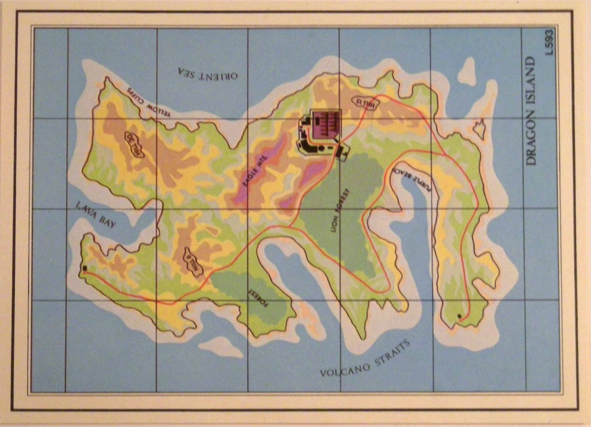

# actionmap 👊

`actionmap` allows users to collaborate on a map to add/modify points and lines, annotate using markers / emojis, and upvote/downvote suggestions. The purpose is to make maps that are highly adaptable to realtime changing information with a minimum friction for map suggestions.
